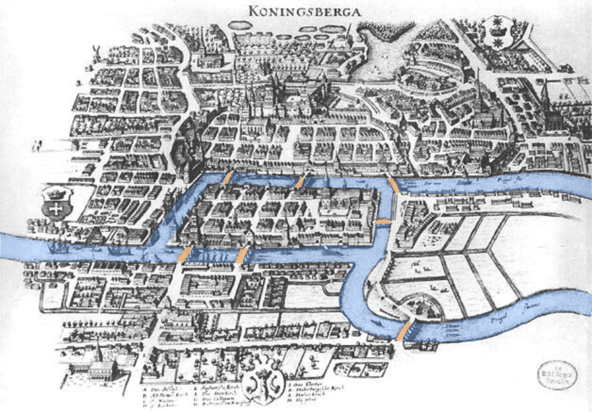

# **Tổng quan về đồ thị**
* Ý tưởng: [VNOI Wiki](https://wiki.vnoi.info/algo/graph-theory/graph)
* Người viết: [Nguyễn Minh Khôi](https://github.com/nguyenminhkhoi2009)
## **Giới thiệu**
### **Mở đầu**
Bạn có biết đến bài toán **"bảy cây cầu Euler"** không?

#### **Giới thiệu về bài toán**
Theo [wikipedia](https://vi.wikipedia.org/wiki/B%C3%A0i_to%C3%A1n_b%E1%BA%A3y_c%C3%A2y_c%E1%BA%A7u_Euler), bài toán bảy cây cầu Euler, còn gọi là **Bảy cầu ở Königsberg** là bài toán nảy sinh từ nơi chốn cụ thể, thành phố Königsberg, Phổ (nay là Kaliningrad, Nga) nằm trên sông Pregel, bao gồm hai hòn đảo lớn nối với nhau và với đất liền bởi bảy cây cầu. Bài toán đặt ra là tìm một tuyến đường mà đi qua mỗi cây cầu một lần và chỉ đúng một lần (bất kể điểm xuất phát hay điểm tới).

Năm 1736, Leonhard Euler đã chứng minh rằng bài toán này là không có lời giải. Kết quả này là cơ sở phát triển của lý thuyết đồ thị và tạo mầm mống cho tô pô học.

#### **Phát biểu bài toán**
Trong thành phố Königsberg (hiện tại là Kaliningrad, Nga), có một con sông chia thành phố thành bốn phần riêng biệt, được kết nối bởi bảy cây cầu. Nhiệm vụ đặt ra là tìm cách đi qua mỗi cây cầu một lần duy nhất và trở về điểm xuất phát ban đầu.

  **Cụ thể:**

    Thành phố Königsberg được chia thành bốn vùng: vùng A, B, C và D.

    Các vùng này được kết nối bởi bảy cây cầu: AB, AC, AD, BC, BD, CD và một cây cầu nữa từ vùng A đến vùng D.
  
Bài toán đặt ra ở đây là: **Hãy tìm một con đường đi qua 7 cây cầu ít nhất một lần và chỉ một lần duy nhất.**

#### **Lời giải của Euler**
* Euler mô hình hóa bài toán bằng lý thuyết đồ thị: các vùng đất là đỉnh (nút) và các cây cầu là cạnh (liên kết).

* Ông phát hiện ra rằng một đường đi Euler (đường đi qua mỗi cạnh một lần và quay về điểm xuất phát) chỉ tồn tại khi không có đỉnh nào có bậc lẻ. Bậc của một đỉnh là số cạnh nối với nó.

* Trong đồ thị các cây cầu Königsberg, cả bốn đỉnh đều có bậc lẻ (mỗi đỉnh đều có số cầu lẻ nối với nó), nên không thể có đường đi Euler.

* **Kết luận:** Không thể đi qua mỗi cây cầu một lần duy nhất và quay về điểm xuất phát trong bài toán Bảy cây cầu Königsberg.

#### **Ý nghĩa của bài toán**

* Định lý đầu tiên của lý thuyết đồ thị: Đây được coi là định lý đầu tiên của lý thuyết đồ thị, mở ra một nhánh nghiên cứu mới trong toán học tổ hợp.

* Khởi đầu của tôpô học: Euler nhận ra rằng thông tin quan trọng là số lượng cầu và danh sách các vùng đất kết nối chúng, không cần đến vị trí chính xác. Điều này đánh dấu sự khởi đầu của ngành tôpô học, nơi hình dạng không gian linh hoạt và không cứng nhắc.

## **Đồ thị là gì?**

Những vòng tròn được gọi là các **đỉnh (vertices)** hoặc các **nút (nodes)**, và những đường thẳng nối những vòng tròn được gọi là các **cạnh (edges)**.

Đồ thị là một cấu trúc dữ liệu cơ bản dùng để mô tả các mối quan hệ giữa các đối tượng. Một đồ thị gồm **hai thành phần chính:**

  1. **Đỉnh (Vertices hay Nodes)**: Đại diện cho các đối tượng hoặc các điểm.
  2. **Cạnh (Edges)**: Đại diện cho mối quan hệ giữa các đỉnh.

Một đồ thị G sẽ được kí hiệu:

  G = (V, E)
  
  Với V là tập hợp chứa các đỉnh, và E là tập hợp chứa các cạnh, mỗi cạnh có dạng một cặp giá trị {u, v} (có thể được viết thành uv). Ví dụ:
  
    G = {{1, 2, 3, 4, 5, 6}, {{1, 2}, {1, 5}, {2, 5}, {2, 3}, {3, 4}, {4, 5}, {4, 6}}} 
  chính là đồ thị ở hình ví dụ trên.

  Tập hợp đỉnh V của độ thì G được kí hiệu V(G), tập hợp cạnh được kí hiệu E(G).
 
## **Có bao nhiêu đồ thị?**
  1. **Đồ thị vô hướng (Undirected Graph)**: Các cạnh không có hướng.
  2. **Đồ thị có hướng (Directed Graph)**: Các cạnh có hướng từ đỉnh này đến đỉnh khác.
  3. **Đồ thị đơn (Simple Graph)**: Không có cạnh lặp lại.
  4. **Đồ thị đa (Multi Graph)**: Có thể có nhiều hơn một cạnh giữa hai đỉnh.
  5. **Đồ thị có trọng số (Weighted Graph)**: Mỗi cạnh có một trọng số.
